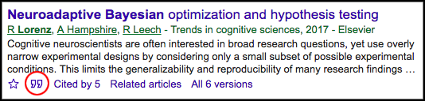
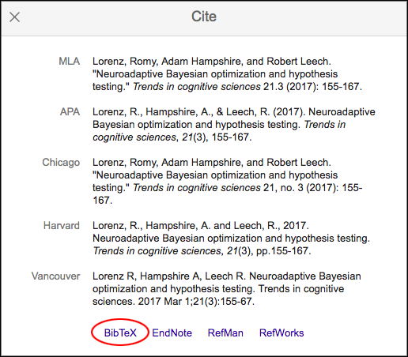
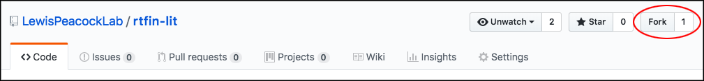
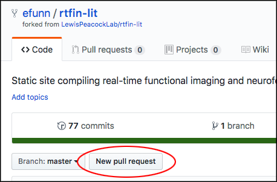

# Literature repository for real-time Functional Imaging and Neurofeedback (rtFIN) community

rtFIN is an international community dedicated to supporting neurofeedback research across all imaging modalities. We maintain a [literature repository](http://www.rtfin.org/literature.html) for all real-time functional imaging applications.

## How to contribute

Anyone with a GitHub account can contribute by adding papers to the `/publications` section of the site. Entries are stored in BibTeX format (`.bib`). For example:

```
@article{lorenz2017neuroadaptive,
  title={Neuroadaptive {Bayesian} optimization and hypothesis testing},
  author={Lorenz, Romy and Hampshire, Adam and Leech, Robert},
  journal={Trends in Cognitive Sciences},
  year={2017},
  publisher={Elsevier},
  imaging={fmri},
  application={methods},
  new={false},
  url={http://www.sciencedirect.com/science/article/pii/S1364661317300098}
}
```

Each year has a separate `.bib` file (e.g. `2017.bib`). To find the BibTeX data for a paper, you can use [Google Scholar](https://scholar.google.com/)'s cite option by clicking on the quote graphic:



Then click on the 'BibTeX' link:



And you'll see the BibTeX data. Next, you'll need to add it to the appropriate year's `.bib` file. To do this, you'll first need to 'fork' the `rtfin-lit` GitHub repository.



This will make a copy of the `rtfin-lit` repository on your GitHub profile. Then, you'll need to download the repository to your computer (either using `git` commands, e.g. `git clone https://github.com/YourUserName/rtfin-lit.git`, or by clicking the download link from the repository on your GitHub profile). Then, using a text editor, add the BibTeX data to the appropriate file (e.g. add it to the file named `publications/2017.bib`, or whatever the year of the publication).

We also ask that you add the imaging modality and application to the entry, as well as a valid URL to access the paper (ideally, a public link or link to a PDF, but paywalled entries are OK too if that's all you can find). For the example given earlier, these are:

```
  imaging={fmri},
  application={methods},
  url={http://www.sciencedirect.com/science/article/pii/S1364661317300098}
```

The options for `imaging` and `application` are:

```
  imaging={fmri, eeg, meg, fnirs, mixed}
  application={neurofeedback, clinical, review, methods}
```

Please select the most appropriate application, to your best judgment. If the study uses multiple imaging methods, select `imaging={mixed}`.

There's also an option to flag new papers with an alarm emoji: 🚨. Simply add it to the BibTeX entry with the 'new' flag:

```
  new={true}
```

And the alarm (🚨) will appear next to the paper. If you're making a major update, go through the old papers and change the 'new' flag to false:

```
  new={false}
```

And the alarm (🚨) will go away for those no-longer-new papers.

Once you have made the changes on your computer, you'll need to push the changes back to your GitHub profile (either by using `git push` or by uploading the updated files to your copy of the GitHub repository). Once your updated files are in the `/publications` subdirectory of your copy of the `rtfin-lit` repository, you'll need to submit a 'pull request':



This will inform the rtFIN admins of your updates. Once we check them over, we'll pull them into the main repository and your changes will go live on [rtfin.org](http://www.rtfin.org/)!
